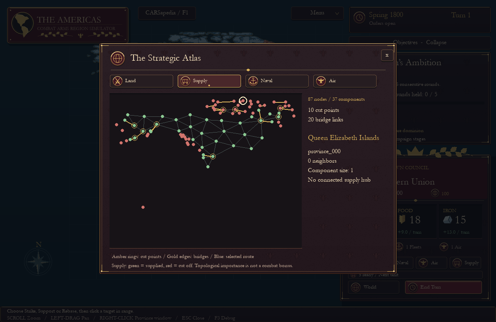
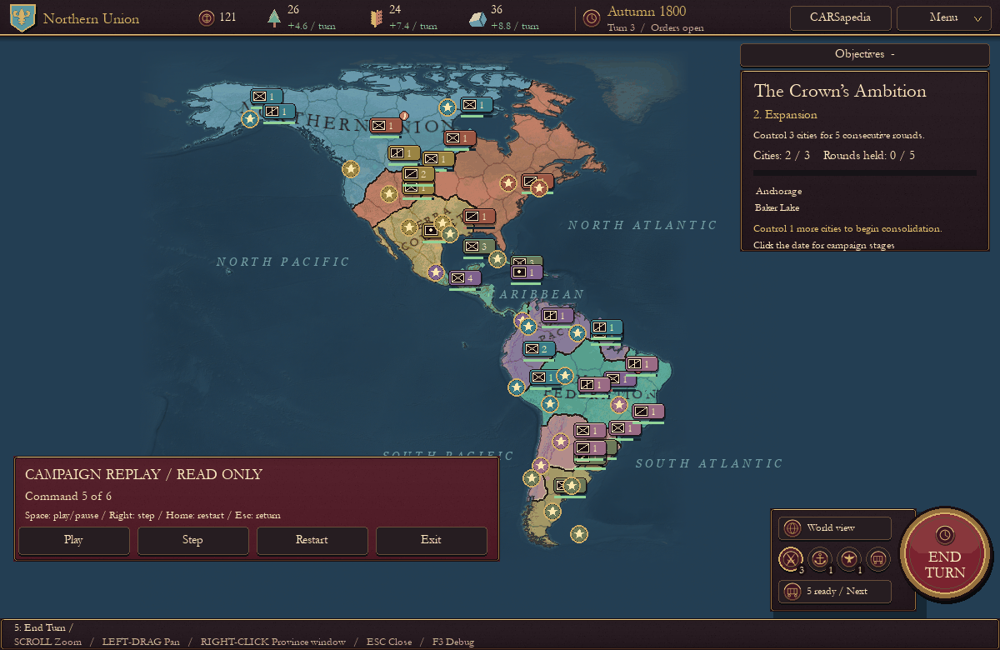

# C.A.R.S. — Combat Arms Region Simulator

**You play on a map. The simulation plays on graphs.**

C.A.R.S. is a turn-based grand-strategy prototype set in the Americas. Eight
fictional nations compete over 186 provinces drawn on real Natural Earth
geography. You command one; seven AI rivals take their turns. Armies, fleets,
air groups and supply lines each move on their own graph, and every rule works
on those graphs. The map you see is only a way to click on them.


## Features

- **Land warfare** on a road-, river- and terrain-weighted province graph, with
  zones of control, supply cut-offs and deterministic attrition combat.
- **Four unit roles plus navy and air**: infantry, scouts, cavalry and field
  artillery; fleets that fight for sea zones; air groups that strike, support or rebase.
- **Economy**: regional wood, food and iron; farms, mills, mines, roads, shipyards
  and airfields; unit upkeep; a merchant exchange for gold.
- **24 regional charters**: named local regiments with their own uniforms and a
  terrain specialty.
- **Order forecasts** that run the real combat rules on a copy of the game, so the
  preview always matches the outcome.
- **Verified replays**: every command is recorded with a hash of the resulting
  state; playback re-simulates the campaign and stops at any divergence.
- **Guided tutorial, searchable CARSapedia and a strategy inspector** that shows
  the graphs themselves: components, choke points and bridges.
- Original procedural artwork, a classical music collection and fully offline play.

<p>
  
  
  
  
</p>

## Play

### Windows download

Download `CARS-Windows.zip` from the [Releases](../../releases) page, extract the
whole folder and run **CARS.exe**. No Python is needed. The build is unsigned, so
Windows may ask for confirmation the first time.

### From source (Windows, macOS, Linux)

Requires Python 3.10 or newer.

```sh
git clone <this repository> && cd CARS
python -m venv .venv
.venv/bin/python -m pip install -e .        # Windows: .venv\Scripts\python ...
.venv/bin/python -m cars
```

On Windows you can also double-click `scripts\run.bat`, which sets up the
environment on first launch; on macOS and Linux run `sh scripts/run.sh`.

Useful options: `--tutorial`, `--faction f0` (skip the picker),
`--fullscreen-windowed`, and `--replay examples/opening.json` to watch a sample.

## How to play

Start with **Guided Tutorial**: ten short lessons that finish when you actually
do each thing. To win a campaign, hold three cities for five consecutive rounds.


| Input | Action |
| --- | --- |
| Left-click a unit, then a highlighted province | Move or attack (hover first for the route and forecast) |
| Right-click a province | Province window: build, develop infrastructure, recruit |
| Left-drag / wheel | Pan / zoom |
| `1` `2` `3` `4` | Land, naval, air and supply layers |
| `Space` | End turn; the rivals then act one order at a time |
| `N` / `F` / `Tab` | Next ready unit / centre selection / cycle a stack |
| `M` / `U` / `J` / `T` | Market / military overview / chronicle / calendar |
| `F1` / `G` / `R` | CARSapedia / strategy graph / replay studio |
| `F5` / `F9` | Save / load (three slots plus an end-of-turn autosave) |
| `F10` / `F11` | Sound and music / fullscreen windowed |

Saves, replays and settings live in your user profile
(`%LOCALAPPDATA%\CARS` on Windows, `~/Library/Application Support/CARS` on macOS,
`~/.local/share/cars` on Linux). Set `CARS_SAVE_DIR` to put them elsewhere.

## Project layout

```
src/cars/
  sim/        game rules: graphs, movement, combat, supply, economy, AI, turns (no pygame)
  persist/    save files and verified replays
  ui/         pygame front end: map view, HUD panels, dialogs, screens, procedural art
  content/    game data, loosely modelled on Paradox's folder layout
    common/     units, buildings, recruitment, market, factions and defines.json
    gfx/        uniform styles
    map/        shaded relief and source hashes
    scenarios/  scenario JSON and province GeoJSON
    text/       CARSapedia entries, unit notes and tutorial lessons
    music/      bundled recordings
tests/        unit and UI tests, mirroring src/
tools/mapgen/ offline scripts that rebuild the map from Natural Earth
packaging/    Windows executable build
```

Balance lives in data: combat modifiers, movement costs and AI weights are all in
`content/common/defines.json`, so tuning never requires touching code. See
[docs/DESIGN.md](docs/DESIGN.md) for how the pieces fit together.

## Development

```sh
python -m pip install -e ".[dev]"
python -m unittest discover -s tests -t .   # full suite, headless
python -m cars --smoke                       # render three frames without a window
ruff check . && ruff format --check .
```

CI runs the suite on Windows, macOS and Linux with Python 3.10 and 3.13. Tagging
a `v*` release builds the Windows download; see
[docs/DEVELOPMENT.md](docs/DEVELOPMENT.md) for the release checklist and
[docs/ROADMAP.md](docs/ROADMAP.md) for what's next.

## Credits and license

Code and procedural artwork are [MIT licensed](LICENSE). Map data comes from
[Natural Earth](MAP_SOURCES.md) (public domain). Recordings are by Kimiko Ishizaka
(CC0) and the Musopen Symphony (public-domain dedication); see
[MUSIC_CREDITS.md](MUSIC_CREDITS.md). Bundled libraries are listed in
[THIRD_PARTY.md](THIRD_PARTY.md). Provinces, nations and regiments are fictional.
