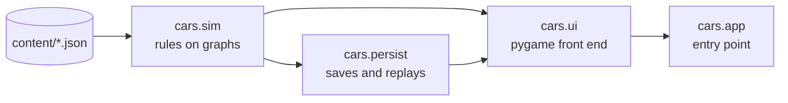

# Design

C.A.R.S. is built around one rule: **the player plays on a map; the simulation
plays on graphs.** Screen geometry never reaches the rules. A click is turned
into a province or sea-zone ID before any command runs, and every command takes
only IDs.

## Layers



Each package may import only the ones to its left. `tests/test_architecture.py`
enforces this, and also checks that `cars.sim` and `cars.persist` never import
pygame. That keeps the rules testable headless and makes replays independent of
how the map is drawn.

### `cars.sim`: the rules

| Module | Responsibility |
| --- | --- |
| `graph`, `topology` | Undirected weighted graphs, bounded Dijkstra, connectivity; Tarjan's components, cut points and bridges |
| `entities`, `state` | Provinces, regions, cities, factions and units; the `GameState` that owns them and the four graphs |
| `scenario` | Loads and validates a scenario |
| `movement`, `supply` | Dynamic step costs and reachability; supply as connectivity to a controlled hub |
| `combat`, `naval`, `air` | Land, sea and air engagements |
| `orders`, `turn` | Move orders; ending a turn (income, hand-over, calendar) |
| `buildings`, `economy`, `market`, `recruitment`, `regional` | Construction, production, trade and raising units |
| `objectives`, `calendar`, `journal` | Victory conditions and stages, seasonal dates, the chronicle |
| `forecast` | Predicts an order by running it on a deep copy of the state |
| `ai` | `RivalCommander`: issues the same validated commands as the player |
| `campaign` | The human boundary: only your faction, only on your turn; feeds the replay recorder |
| `defines` | Loads `defines.json` into frozen dataclasses, so a typo fails at start-up |

Commands validate first and mutate second. A refused order returns a reason and
changes nothing, which the tests check. The AI goes through exactly the same
commands, so it cannot make an illegal move. It sees only what the fog of war
shows its faction, and judges attacks with `combat.assess`, the same calculation
the battle itself uses.

### The four graphs

| Graph | Nodes | Used for |
| --- | --- | --- |
| Land | provinces | Movement. Step cost combines terrain, unit role, regional charter, roads, rivers, passes and the zones of control of enemies in sight; unsupplied units pay 50% more. Hostile provinces can be entered but not crossed. |
| Supply | provinces | A land unit is supplied if a chain of provinces its faction controls links it to a controlled supply hub. |
| Naval | sea zones | Fleet movement; a sea zone holding an enemy fleet ends the route and starts a battle. |
| Air | provinces and sea zones | Operational range from a controlled airbase. |

Every pair of factions is at war unless `state.relations` records a peace treaty.
All hostility checks go through `GameState.at_war`: peace makes the partner's
provinces impassable and removes its units from combat, zones of control, air
strikes and interception.

Ownership and control are separate: capturing a province changes its controller,
never its rightful owner, and buildings stay with the province.
Damage is not permanent: when a faction's turn begins its units recover strength
if they are supplied on friendly ground (more in a city), fleets beside a friendly
port and air groups at a working airbase, so supply lines also decide how fast an
army can fight again. Armies also cost upkeep every turn, so the size of a realm's
forces is bounded by what it produces.

| Algorithm | Player-facing effect | Complexity |
| --- | --- | --- |
| Bounded Dijkstra | Reachable provinces and the cheapest route | O((V + E) log V) |
| Neighbourhood lookup | Extra cost next to hostile armies | O(degree of enemy units) |
| Multi-source traversal | Supplied or cut off | O(V + E) |
| Tarjan's DFS | Components, cut points and bridges in the inspector | O(V + E) |

The inspector's cut points and bridges are structural hints, not combat bonuses.

Fog of war is also computed on the graphs: `sim/visibility.py` returns the nodes a
faction can see (its provinces and their land neighbours, the neighbours of each
unit, and sea zones beside its ports and fleets). The renderer hides enemy units
outside that set and shades those provinces; the rules themselves are unaffected.

## Determinism and replays

The rules use no randomness, and every tie-break is explicit (sorted IDs, stable
dict order), so the same commands always produce the same game. The replay
recorder stores a starting snapshot plus each successful command and a SHA-256
hash of the resulting state. Playback re-runs the commands on a separate copy and
stops at the first hash mismatch. An End Turn command includes all seven rival
turns. Replay files are data: commands are looked up by name, never executed as
code. `RULESET` in `persist/replay.py` must change whenever a rule change would
alter the outcome of a recorded command.

## Saves

A save is a complete JSON snapshot of the campaign. The map never changes during
play, so a save made on a bundled scenario records the scenario's name and a
digest of its shapes, sea zones and graphs rather than a copy; a save on any
other map embeds it. A save whose digest no longer matches the bundled map is
refused rather than loaded onto the wrong geography. Loading validates every
cross-reference (units, provinces, terrain, buildings, graph endpoints, journal,
objectives) and raises `ValueError` on anything inconsistent. Older formats are
upgraded one version at a time. Files are written through a temporary file, so a crash
never leaves a half-written save.

## User interface

```
ui/app.py          window, active screen, frame loop
ui/screens/        TitleScreen, GameScreen (input and turn flow), ReplayScreen
ui/renderer.py     GameRenderer: map plus HUD for a GameState; drawing and hit testing only
ui/map/            MapView (camera, hit testing, overlays), Atlas (the painted base map),
                   border geometry, labels, relief, march animation
ui/hud/            council, province window, objectives, menu, market, forecast card, faction picker
ui/dialogs/        modal dialogs sharing one frame: library, roster, chronicle, settings, music,
                   calendar, CARSapedia, strategy atlas, replay studio
ui/art/            procedural sprites, insignia, cities, buildings and ornament
```

`GameScreen` handles input as a chain of handlers in priority order: an open
dialog, the tutorial card, top-bar shortcuts, the market, the menu, file
shortcuts, the faction picker and finally orders on the map. Each HUD panel owns
its own rectangles, drawing and hit testing. `GameRenderer` draws both live play
and read-only replays; the replay screen simply gives it a different state.

A left press on the map is held until release, so dragging to pan can never issue
an order. Moves resolve immediately; the march animation only replays the result.

### The map

The base map is painted in world space, where one degree is `scale` pixels, by an
`Atlas` for each zoom level. It paints 256-pixel tiles on first use and keeps
them, so panning only blits cached tiles; the three most recent zoom levels are
kept. When a province changes hands, only the tiles it touches are repainted.

Each tile is painted in layers: the Natural Earth relief, graded into a dark sea
wash; lighter shallows along the coasts; each nation's land as relief dyed and
tinted in its colour, with a glow along its frontiers; engraved forest and
mountain symbols; then faint province borders, strong nation borders and the
coastline. Borders come from `geometry.borders`, which classifies every outline
segment by the provinces on either side of it. Fog of war is a separate tile
layer, cached per set of hidden provinces. Pins, units, routes and labels are
drawn over the atlas in screen space every frame.

## Content and modding

Everything a designer would tune is data under `src/cars/content/`:

- `common/defines.json`: movement, combat, naval, air and AI constants
- `common/units.json`, `recruitment.json`, `buildings.json`, `market.json`,
  `factions.json`, `regional_units.json`, `calendar.json`
- `gfx/uniform_styles.json`: the eight regional uniform styles
- `text/`: CARSapedia entries, unit notes and tutorial lessons
- `events/`: scripted events. Each has a `trigger` (all conditions must hold) and
  two or more `options` with `effects`. The available trigger and effect names are
  the `TRIGGERS` and `EFFECTS` tables in `sim/events.py`; an unknown name fails
  at start-up rather than in the middle of a campaign.
- `scenarios/`: scenario JSON (provinces, regions, cities, units, graphs,
  objectives) with a sibling GeoJSON for province shapes

A scenario can use any of the four graphs freely; the map geometry only needs a
shape for each province ID.
