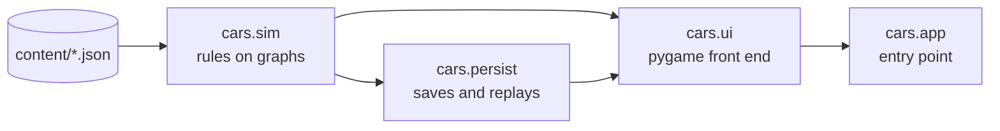

# Design

C.A.R.S. is built around one rule: **the player plays on a map; the simulation
plays on graphs.** Screen geometry never reaches the rules. A click is turned
into a province or sea-zone ID before any command runs, and every command takes
only IDs.

## Layers



Each package may import only the ones to its left. `tests/test_architecture.py`
enforces this, and also checks that `cars.sim` and `cars.persist` never import
pygame. That keeps the rules testable headless and makes replays independent of
how the map is drawn.

### `cars.sim`: the rules

| Module | Responsibility |
| --- | --- |
| `graph`, `topology` | Undirected weighted graphs, bounded Dijkstra, connectivity; Tarjan's components, cut points and bridges |
| `entities`, `state` | Provinces, regions, cities, factions and units; the `GameState` that owns them and the four graphs |
| `scenario` | Loads and validates a scenario |
| `movement`, `supply` | Dynamic step costs and reachability; supply as connectivity to a controlled hub |
| `combat`, `naval`, `balloons` | Land and sea engagements; balloon observation and spotting |
| `orders`, `turn` | Move orders; ending a turn (income, hand-over, calendar) |
| `buildings`, `economy`, `market`, `recruitment`, `regional` | Construction, production, trade and raising units |
| `objectives`, `calendar`, `journal` | Victory conditions and stages, seasonal dates, the chronicle |
| `forecast` | Predicts an order by running it on a deep copy of the state |
| `ai` | `RivalCommander`: issues the same validated commands as the player |
| `campaign` | The human boundary: only your faction, only on your turn; feeds the replay recorder |
| `defines` | Loads `defines.json` into frozen dataclasses, so a typo fails at start-up |

Commands validate first and mutate second. A refused order returns a reason and
changes nothing, which the tests check. The AI goes through exactly the same
commands, so it cannot make an illegal move. It sees only what the fog of war
shows its faction, and judges attacks with `combat.assess`, the same calculation
the battle itself uses.

### The four graphs

| Graph | Nodes | Used for |
| --- | --- | --- |
| Land | provinces | Movement. Step cost combines terrain, unit role, regional charter, roads, rivers, passes and the zones of control of enemies in sight; unsupplied units pay 50% more. Hostile provinces can be entered but not crossed. |
| Supply | provinces | A land unit is supplied if a chain of provinces its faction controls links it to a controlled supply hub. |
| Naval | sea zones | Fleet movement; a sea zone holding an enemy fleet ends the route and starts a battle. |
| Air | provinces | A balloon corps' range from a province its nation controls. |

Every pair of factions is at war unless `state.relations` records a peace treaty.
A scenario can list the wars already under way (`"wars"` in its JSON); every other
pair then starts at peace under a truce. Rivals only declare war on a neighbour.
All hostility checks go through `GameState.at_war`: peace makes the partner's
provinces impassable and removes its units from combat and zones of control,
and ends any artillery spotting over its ground.

Ownership and control are separate: capturing a province changes its controller,
never its rightful owner, and buildings stay with the province.
Damage is not permanent: when a faction's turn begins its units recover strength
if they are supplied on friendly ground (more in a city), fleets beside a friendly
port and balloon corps in a city their nation holds, so supply lines also decide how fast an
army can fight again. Armies also cost upkeep every turn, so the size of a realm's
forces is bounded by what it produces.

| Algorithm | Player-facing effect | Complexity |
| --- | --- | --- |
| Bounded Dijkstra | Reachable provinces and the cheapest route | O((V + E) log V) |
| Neighbourhood lookup | Extra cost next to hostile armies | O(degree of enemy units) |
| Multi-source traversal | Supplied or cut off | O(V + E) |
| Tarjan's DFS | Components, cut points and bridges in the inspector | O(V + E) |

The inspector's cut points and bridges are structural hints, not combat bonuses.

Fog of war is also computed on the graphs: `sim/visibility.py` returns the nodes a
faction can see (its provinces and their land neighbours, the neighbours of each
unit, and sea zones beside its ports and fleets). The renderer hides enemy units
outside that set and shades those provinces; the rules themselves are unaffected.

## Determinism and replays

The rules use no randomness, and every tie-break is explicit (sorted IDs, stable
dict order), so the same commands always produce the same game. The replay
recorder stores a starting snapshot plus each successful command and a SHA-256
hash of the resulting state. Playback re-runs the commands on a separate copy and
stops at the first hash mismatch. An End Turn command includes all seven rival
turns. Replay files are data: commands are looked up by name, never executed as
code. `RULESET` in `persist/replay.py` must change whenever a rule change would
alter the outcome of a recorded command.

## Saves

A save is a complete JSON snapshot of the campaign. The map never changes during
play, so a save made on a bundled scenario records the scenario's name and a
digest of its shapes, sea zones and graphs rather than a copy; a save on any
other map embeds it. A save whose digest no longer matches the bundled map is
refused rather than loaded onto the wrong geography. Loading validates every
cross-reference (units, provinces, terrain, buildings, graph endpoints, journal,
objectives) and raises `ValueError` on anything inconsistent. Older formats are
upgraded one version at a time. Files are written through a temporary file, so a crash
never leaves a half-written save.

## User interface

```
ui/app.py          window, active screen, frame loop
ui/context.py      services shared by every screen: the toolkit, audio, pointer, UI scale
ui/kit/            the toolkit: palette and type scale, text, panels, buttons, icons,
                   sortable tables, static grids and tooltips, all drawn at native size
ui/frames.py       Frame, DockedPanel and Window: framed, scrolling content with click areas
ui/screens/        TitleScreen, GameScreen (input and turn flow), ReplayScreen
ui/renderer.py     GameRenderer: map plus the shell for a GameState; layout and hit testing
ui/hud/            the shell: top bar, side bar, outliner, map-mode bar and End Turn,
                   unit card, notifications, forecast card
ui/panels/         docked panels: province, nation, military, diplomacy, market, chronicle
ui/windows/        modal windows: menu, save and load, settings, music, keyboard, calendar,
                   strategic atlas, replay studio, event, nation picker
ui/pedia/          the CARSapedia: its generated library and the window that reads it
ui/map/            MapView (camera, hit testing, overlays), Atlas (the painted base map),
                   border geometry, labels, nation names, markers, arrows, animation
ui/art/            procedural sprites, icons, cities, buildings and paintings
```

The game draws straight onto the window at its native resolution. Every size in
the interface is a logical size that the toolkit multiplies by the UI scale,
which defaults from the window height (100% below 1075 pixels, 125% at 1080p,
150% at 1440p, 200% at 2160p) and can be set in Settings. The renderer lays the
shell out afresh each frame from the window size, so resizing needs no special
handling; the camera keeps the same part of the map in view at the same relative
zoom.

Panels and windows are drawn immediately each frame. While drawing, a frame
registers the areas that respond to clicks (``Frame.clickable``), and input is
routed by looking those up, so drawing and hit testing never disagree. Content
taller than its frame scrolls. Tables (``kit/table.py``) sort by any column and
scroll themselves; small fixed tables use ``kit/grid.py``.

`GameScreen` routes input in priority order: an open window, the tutorial card,
keyboard shortcuts, the docked panel, the shell, and finally the map. A left
press on the map is held until release, so dragging to pan can never issue an
order. Moves resolve immediately; the march animation only replays the result.
`GameRenderer` draws both live play and read-only replays; the replay screen gives
it a different state and turns off the command interface.

The CARSapedia (``ui/pedia``) builds its library at start-up from the authored
articles in ``content/text/carsapedia.json`` and generated articles for every
nation, unit, charter, building, terrain and event. Authored text writes rule
values as placeholders such as ``{combat.river_attack_factor}``, filled from the
defines, and links as ``[[article-id]]``; a link to a missing article stops the
game at start-up rather than showing a dead link.

### The map

The base map is painted in world space, where one degree is `scale` pixels, by an
`Atlas` for each zoom level. It paints 256-pixel tiles on first use and keeps
them, so panning only blits cached tiles; the four most recent zoom levels and
map modes are kept. A map mode is a colouring: each province's colour comes from
its controller (political), from nothing (terrain), from its supply (supply) or
from its relation to the player (diplomatic). When a province changes hands, only the tiles it touches are repainted.

Each tile is painted in layers: a deep sea that lightens towards every coast
(from a blurred land mask of the Natural Earth relief); each nation's land in its
colour over the relief's hill shading, with the raster's land-cover tints taken
out so only slopes show, and the colour deepening towards its frontiers; then
faint province borders, nation borders and the coastline. How much colour covers
the terrain depends on the zoom: bold at world view, fading as the camera comes
in so the relief shows through. Borders come from `geometry.borders`, which classifies every outline
segment by the provinces on either side of it. Fog of war is a separate tile
layer, cached per set of hidden provinces. Pins, units, routes and labels are
drawn over the atlas in screen space every frame. Each stack is one plate
(`map/markers.py`); zoomed in, the leading unit's figure stands on it. Cities are
drawn as their towns, with names once zoomed in; victory points appear only on
the diplomacy panel's war screen. Routes are smooth, tapering arrows through a
Catmull-Rom spline of the province anchors (`map/arrows.py`).

Zoomed out, nation names replace province names (`map/nation_labels.py`). Each
nation's land is rasterised at two pixels per degree and split into connected
territories; the principal axis of a territory and the midline of its land along
that axis give a gently bent curve. The name is set along it at the largest size,
and position, at which every letter stands on the territory, on two lines if one
will not fit. Curves are cached per territory and only recomputed for nations
whose land changed.

## Content and modding

Everything a designer would tune is data under `src/cars/content/`:

- `common/defines.json`: movement, combat, naval, balloon and AI constants
- `common/units.json`, `recruitment.json`, `buildings.json`, `market.json`,
  `factions.json`, `regional_units.json`, `calendar.json`
- `common/nations.json`: each nation's history, ruler, capital and two national
  traits. A trait is a set of modifiers (see `sim/nations.py` for the keys) that
  the rules look up for recruitment costs, attack, defence, movement, production,
  upkeep, gold income and storage; an unknown key fails at start-up.
- `gfx/uniform_styles.json`: the eight regional uniform styles
- `text/`: CARSapedia entries, unit notes and tutorial lessons
- `events/`: scripted events. Each has a `trigger` (all conditions must hold) and
  two or more `options` with `effects`. The available trigger and effect names are
  the `TRIGGERS` and `EFFECTS` tables in `sim/events.py`; an unknown name fails
  at start-up rather than in the middle of a campaign.
- `scenarios/`: scenario JSON (provinces, regions, cities, units, graphs,
  objectives) with a sibling GeoJSON for province shapes

A scenario can use any of the four graphs freely; the map geometry only needs a
shape for each province ID.
